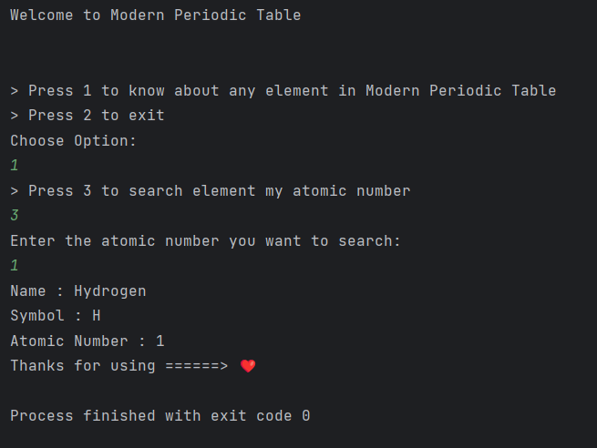

# Welcome to Project 2
Here I created a program using java to get information about Periodic Table Element.

# Usage
> Choose 1 for process. <br> <br>
> Choose 2 to directly end. <br>

After that if you selected 1

> Choose 3 to continue

After this,

>Type as atomic number of which element you want to information (eg. 1, 2, 3, ......, 118.)

```
Name : Hydrogen
Symbol : H
Atomic Number : 1
Thanks for using ======> ❤️ 
```


You will get information in the above format.

# Screenshot

